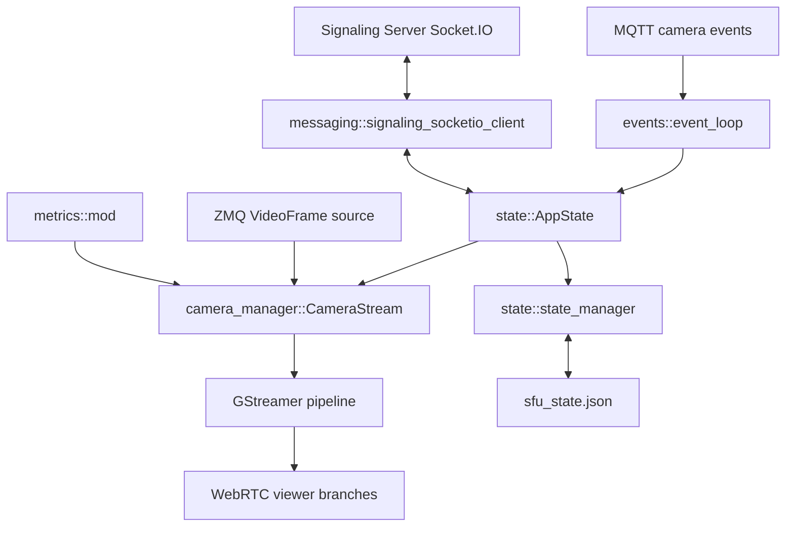

# local-live-streamer – Current Architecture

This adapter is the edge-side WebRTC SFU for the local pipeline. It now uses MQTT/EMQX for control events instead of RabbitMQ.

## Responsibilities

- consume camera lifecycle CloudEvents from MQTT command topics
- create and remove per-camera GStreamer pipelines
- ingest encoded frames from ZeroMQ
- relay WebRTC signaling through Socket.IO
- persist and restore active camera state
- emit stream-level metrics from the camera pipeline path

## High-level architecture

## Runtime flow

1. `src/main.rs` initializes GStreamer and starts the runtime.
2. `src/runtime.rs` loads env-backed settings and creates the MQTT client.
3. `src/clients/mqtt.rs` subscribes to gateway-specific command topics.
4. `src/events/event_loop.rs` parses CloudEvents and maps them to camera actions.
5. `AppState` creates, updates, stops, or removes `CameraStream` entries.
6. Each `CameraStream` runs a GStreamer pipeline fed by ZeroMQ frames.
7. `src/messaging/signaling_socketio_client.rs` handles viewer requests and WebRTC signaling.
8. `state/state_manager.rs` persists active cameras to `sfu_state.json`.

## Inputs

### MQTT control plane

Default subscribed topics:

- `video/cloud_to_edge/nativevms-gateway-{MQTT_GATEWAY_UUID}/camera.create_streaming`
- `video/cloud_to_edge/nativevms-gateway-{MQTT_GATEWAY_UUID}/camera.delete_streaming`

The payload format is a JSON CloudEvent containing `data.current` and `data.previous` camera lists.

### ZeroMQ media input

Per-camera encoded frames arrive over ZeroMQ and are pushed into `appsrc`.

### Viewer signaling input

Viewer requests and SDP/ICE messages arrive from the Socket.IO signaling server.

## Outputs

- WebRTC media streams for active viewers
- stream register/unregister events to the signaling server
- persisted state in `sfu_state.json`
- runtime logs and stream metrics

## Module boundaries

- `clients/`: MQTT client wiring
- `events/`: CloudEvent parsing and dispatch
- `messaging/`: Socket.IO signaling integration
- `state/`: runtime registry and persisted state
- `camera_manager.rs`: camera pipelines and viewer branches
- `metrics/`: stream-level metrics

## Network connectivity specification (Local LiveStreamer)

Local LiveStreamer is a P2P-oriented WebRTC module. It uses a signaling server for control plane and peer-to-peer media transport for data plane.

Role summary:

- P2P WebRTC streaming module
- Control-plane dependency: external signaling server
- Data-plane media: direct peer-to-peer where possible
- NAT/firewall handling may require TURN

### Deployment and firewall notes

- Local LiveStreamer requires bidirectional UDP communication for low-latency P2P.
- In strict NAT/firewall environments, TURN should be enabled and reachable.
- The signaling server is control-plane only; media may still fail if UDP rules are blocked.
- Lowest latency is achieved when direct peer connectivity is available.
