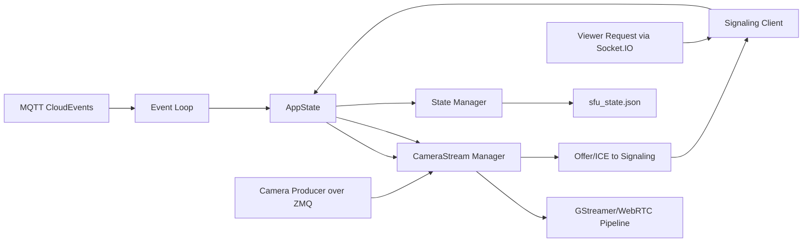
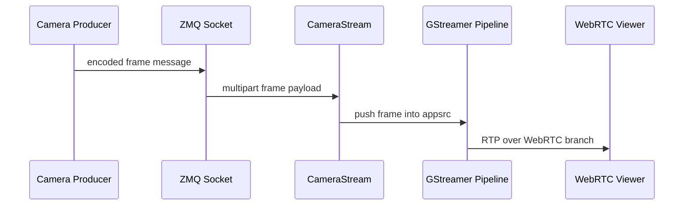

# local-live-streamer - Data Flow

## Overview

The local SFU has four main data paths:

- MQTT control events
- ZeroMQ encoded video frames
- Socket.IO signaling messages
- persisted runtime state in `sfu_state.json`

## End-to-end summary

## Control plane flow

### MQTT ingestion

1. Runtime connects to the configured MQTT broker.
2. It subscribes to gateway-scoped command topics.
3. Incoming `Publish` packets are forwarded into an internal Tokio channel.

### CloudEvent parsing

`events/event.rs` deserializes the payload and maps camera lifecycle event types such as:

- `camera.create_streaming`
- `camera.start_streaming`
- `camera.stop_streaming`
- `camera.delete_streaming`

Camera data is taken from `data.current` or `data.previous` depending on the event type.

### Camera action execution

`events/event_loop.rs` applies the action to `AppState`, which creates, updates, stops, or removes the relevant `CameraStream`.

## Signaling and viewer flow

1. The Socket.IO client connects and sends `sfu_register`.
2. When a camera becomes available, the adapter registers the stream metadata.
3. On `viewer_request`, a viewer-specific WebRTC branch is attached to the camera tee.
4. SDP and ICE messages are exchanged through Socket.IO.
5. On disconnect, the viewer branch is removed.

## Media flow

## Persistence flow

- on startup, `state_manager` restores previously running cameras
- on camera lifecycle changes, `sfu_state.json` is updated
- restored streams are re-registered with signaling

## Resiliency notes

- MQTT reconnects are handled by the client event loop
- signaling reconnects retry automatically
- invalid events are logged and skipped
- state restore failures are non-fatal
