# local-live-streamer — Workflow Diagrams

This file summarizes the current MQTT-based workflow used by local-live-streamer.

## 1. Startup

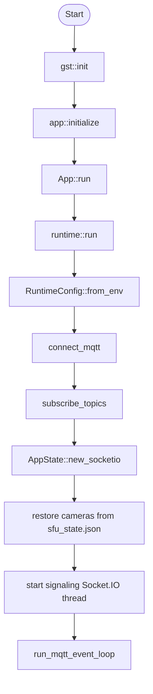

## 2. MQTT Event Processing

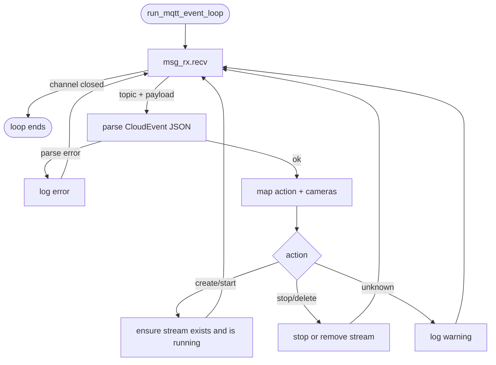

## 3. Camera Pipeline Flow

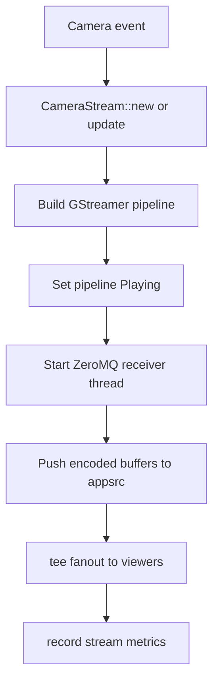

## 4. Viewer Join Flow

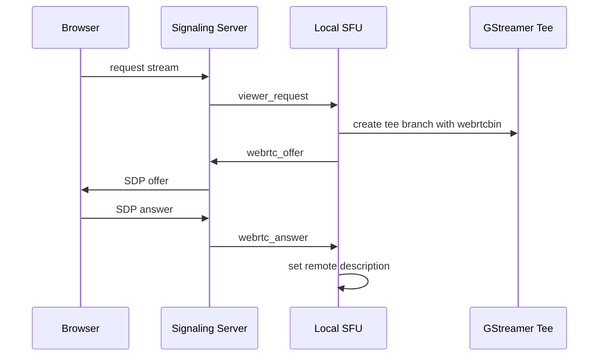

## 5. State Persistence

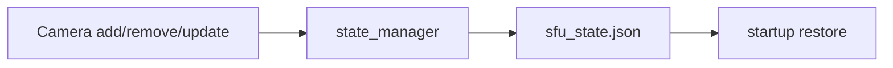

    loop ICE candidates
        Browser->>SigServer: ICE candidate
        SigServer->>SFU: webrtc_ice_candidate (viewer_id, candidate)
        SFU->>SFU: webrtcbin.add-ice-candidate
    end

    SFU-->>Browser: WebRTC video stream flowing
```

---

## 7. Viewer Disconnect

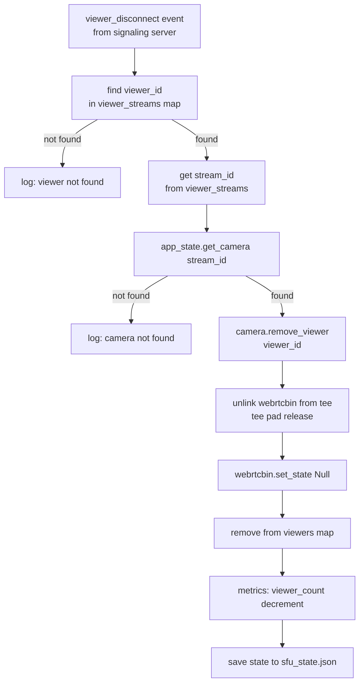

---

## 8. Camera Delete Flow

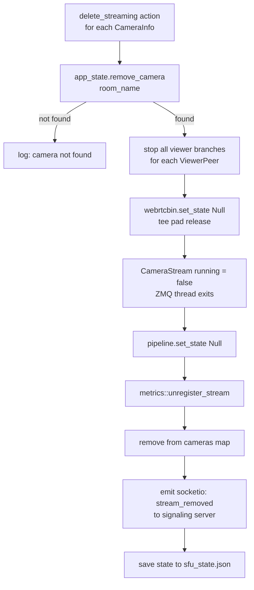

---

## 9. Socket.IO Signaling Client Lifecycle

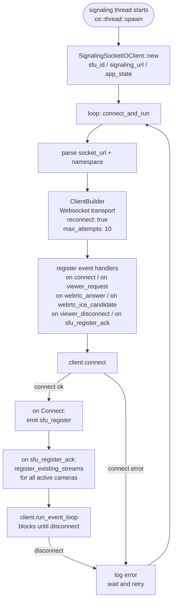

---

## 10. Stream Metrics (5-Second Rolling Window)

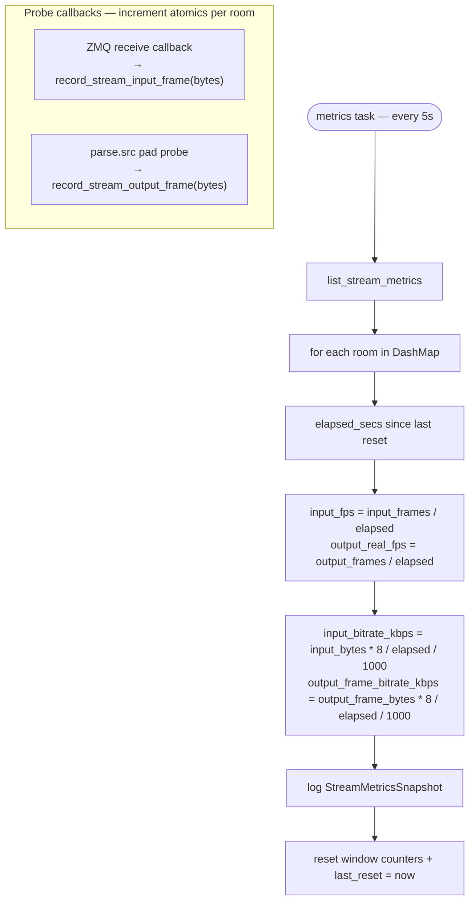

---

## 11. Persistent State (sfu_state.json)

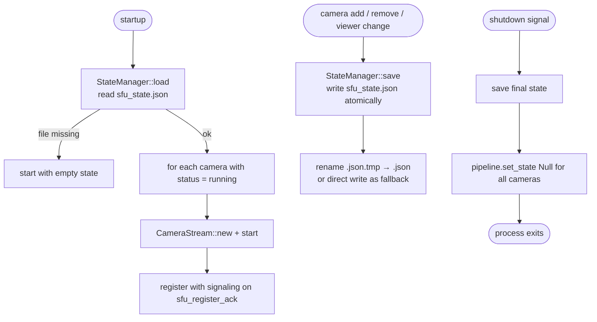

---

## 12. Camera Stream States

```mermaid
stateDiagram-v2
    [*] --> Initializing: CameraStream::new

    Initializing --> Starting: add_camera called
    Starting --> Running: pipeline Playing\nZMQ thread connected
    Running --> Running: frames flowing\nviewers joining/leaving
    Running --> Stopping: delete_streaming or remove_camera
    Stopping --> [*]: pipeline Null\nmetrics unregistered

    Running --> Error: GStreamer bus error
    Error --> Stopping: cleanup triggered

    note right of Running
        status = "running"
        Saved to sfu_state.json
        Restored on restart
    end note

    note right of Error
        bus error or EOS
        pipeline auto-cleanup
    end note
```

---

## 13. Codec Auto-Detection

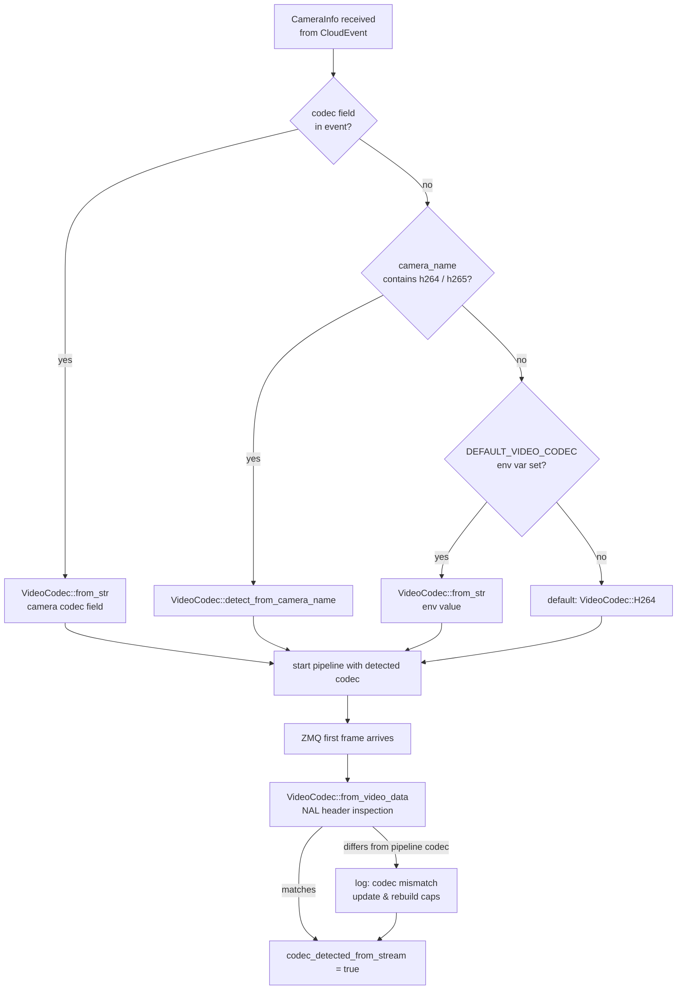
